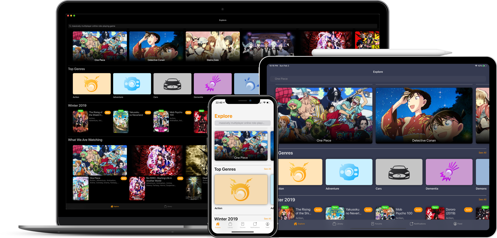

    <em>Discover, share and track anime with friends.</em>

# Kurozora    

[Kurozora](https://kurozora.app) is your go-to platform **discovering**, **sharing** and **tracking** anime and much more! `kurozora-app` is the client side of the Kurozora service. It is designed to be:

* **🏃🏻‍♂️ Responsive:** Kurozora is built with Swift, one of the **fast**, **modern**, **safe** and **interactive** programming languages.

* **💻 Colossal:** The app is carefully designed to work perfectly on all screen sizes. Yes even on Samsung's Insane 292-Inch Wall TV.

* **🎨 Chameleon:** Whether black, blue, purple, or orange, it looks too good to… uh oh, it’s gone hiding again, dammit!

* **📚 Documented:** With up to 65% documentation coverage and more in production. Just need my publisher to finalise some last minute details.

* **💕 Excellence:** [Kurozora API](https://github.com/musa11971/kurozora-web) and Kurozora app are simply meant to be for each other. It’s like peanut butter and jelly, like yin and yang, like a lace in a shoe, like you're the sail of my love boat wait.. ughhh…

* **🧩 Essence:** All brought together with [KurozoraKit](https://github.com/kiritokatklian/KurozoraKit), creating a perfect harmony. It’s the piece of the puzzle you don’t want to be missing.

# Screenshots

# Requirements

An iPhone/iPad running iOS 12+ or a Mac running macOS 10.15+

# Tools

Kurozora uses a few 3rd party tools to make development as easy and uniform as possible.

##  CocoaPods

We use [CocoaPods](https://cocoapods.org/) — a dependency manager for Swift and Objective-C Cocoa projects — to manage third party libraries.

## SwiftLint

We use SwiftLint to enforce a common style for Swift code. The app should build and work without it, but if you plan to write code, you are encouraged to install it. No commit should have lint warnings or errors.

## R.swift

We use [R.swift](https://github.com/mac-cain13/R.swift) to get strong typed, autocompleted resources like images, fonts and segues.

## Jazzy

We use [Jazzy](https://github.com/realm/jazzy) to generate [documentation](https://kiritokatklian.github.io/kurozora-app/) for the app. This documentation can also be installed in [Dash](https://kapeli.com/dash).

# Contributing

Read our [Contributing Guide](CONTRIBUTING.md) to learn about reporting issues, contributing code, and more ways to contribute.

# Security

If you happen to find a security vulnerability, we would appreciate you letting us know at kurozoraapp@gmail.com and allowing us to respond before disclosing the issue publicly.

# Getting in Touch

If you have any questions or just want to say hi, join the Kurozora [Discord](https://discord.gg/bHUmr3h) and drop a message on the #development channel.

# License

Kurozora app is an Open Source project covered by the [GNU Affero General Public License v3.0](LICENSE).
